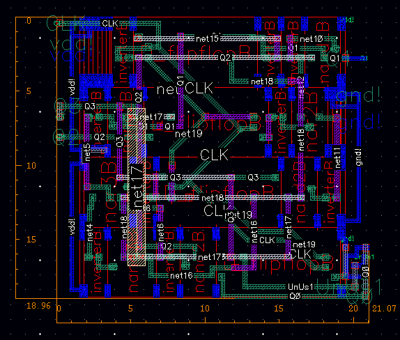
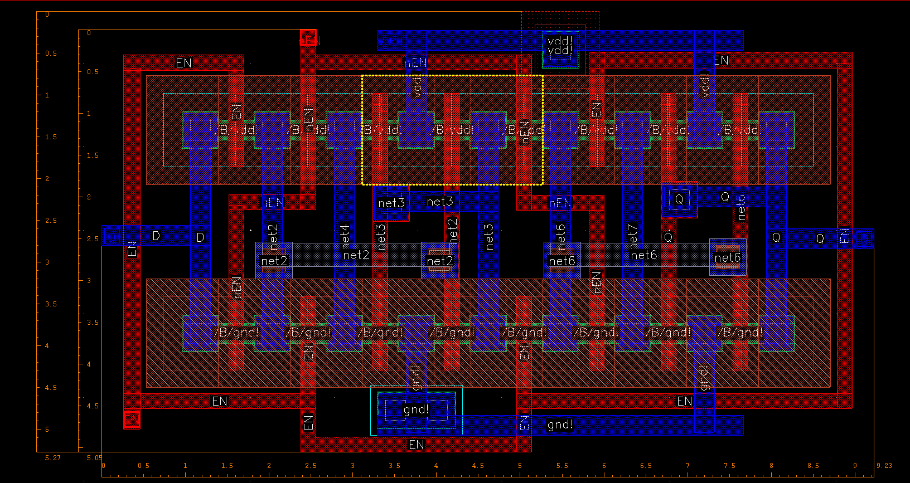
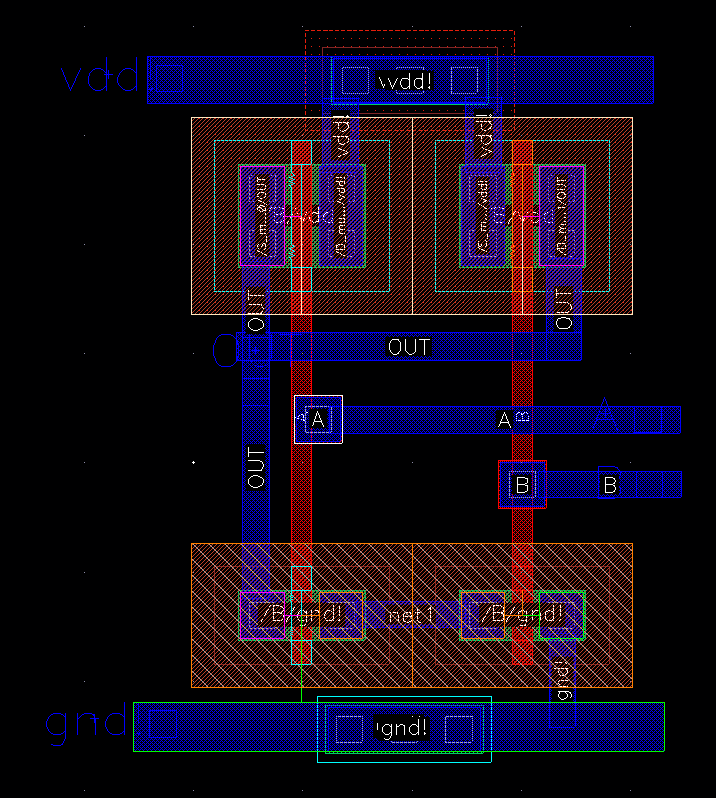

# CMOS VLSI Circuit Designs

A comprehensive portfolio of digital integrated circuit designs implemented in **CMOS 180nm technology**. The project demonstrates the full custom design flow: from transistor-level schematic capture, through physical layout design (Place & Route), to verification (DRC, LVS) and post-layout simulation.

## Project Overview

**Course:** Integrated Circuits and Systems (SUISE)
**Technology Node:** 180nm CMOS
**Supply Voltage:** 1.8V

The repository documents the design of three progressive digital blocks, focusing on **area optimization** and signal integrity.

## Featured Designs

### 1. Synchronous Down Counter (4-bit)
**Function:** A synchronous counter counting down from 14 to 0 (step 2) in Natural Binary Code (NBC).

*Above: Physical layout of the 4-bit counter showing optimized placement.*

* **Architecture:** Built using D Flip-Flops and standard logic gates (AND, OR, NOT).
* **Layout Optimization:** Designed to achieve a near-square footprint for easier integration.
* **Key Metrics:**
    * **Dimensions:** $18.96 \mu m \times 21.07 \mu m$
    * **Total Area:** $\approx 399.5 \mu m^2$
    * **Power Consumption:** Optimized for dynamic power efficiency.

### 2. D-Latch with Transmission Gates
**Function:** A level-sensitive D-Latch.

*Above: Compact layout utilizing transmission gates to reduce transistor count.*

* **Design Strategy:** Utilized **Transmission Gate (TG)** logic instead of standard static CMOS to reduce transistor count and improve density.
* **Layout Optimization:** Components arranged in single N+/P+ diffusion strips to minimize spacing rules.
* **Key Metrics:**
    * **Dimensions:** $5.27 \mu m \times 9.23 \mu m$
    * **Total Area:** $\approx 48.6 \mu m^2$
* **Verification:** Validated via Layout Vs. Schematic (LVS) and transient analysis.

### 3. NAND Gate
**Function:** Fundamental 2-input NAND logic gate.

*Above: Standard cell layout for a 2-input NAND gate.*

* **Analysis:**
    * **DC Analysis:** Voltage Transfer Characteristics (VTC) and switching threshold verification (~0.9V).
    * **Transient Analysis:** Rise/fall time measurement under 10fF load.
    * **Power:** Dynamic vs. Static power dissipation analysis.

## Tools & Methodology

This project follows the standard ASIC design flow:
1.  **Schematic Entry:** Transistor-level design (PMOS/NMOS).
2.  **Symbol Creation:** Abstraction for higher-level hierarchy.
3.  **Physical Layout:** Manual polygon pushing, adhering to Design Rules (DRC).
4.  **Verification:**
    * **DRC:** Design Rule Check.
    * **LVS:** Layout vs. Schematic matching.
    * **PEX:** Parasitic Extraction (R+C+CC).
5.  **Simulation:** Analog simulation using Spectre/Spice.

## Documentation

Full engineering reports (in Polish) including waveforms, schematics, and layout screenshots are available in the `docs/` directory:
* [Synchronous Counter Report](docs/Synchronous_Counter_Report.pdf)
* [D-Latch Report](docs/D_Latch_Report.pdf)
* [NAND Gate Report](docs/NAND_Gate_Report.pdf)

## Authors and Context

* **Author:** Filip Żurek
* **Institution:** AGH University of Krakow
* **Faculty:** Faculty of Computer Science, Electronics and Telecommunications
* **Field of Study:** Electronics and Telecommunications
* **Course:** Integrated Circuits and Systems

## License

This software is distributed under the MIT License. Refer to the [LICENSE](LICENSE) file for the full text.

---
*AGH University of Krakow - Integrated Circuits and Systems 2025*